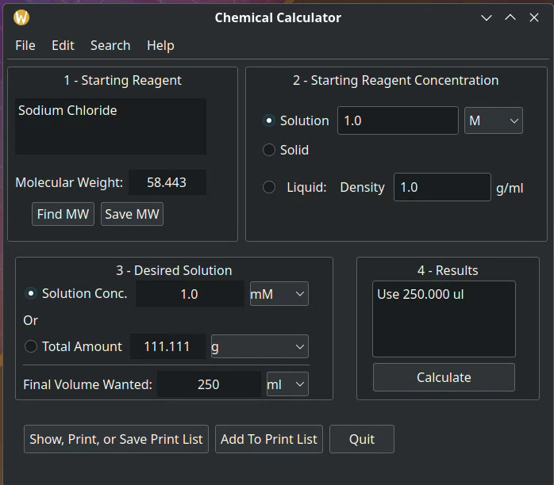

*** NOTE: (September 27 2004) This program is not yet ready for use.  
*** It will be a few more days, and I will take down this note when ready for public use.

Chemical Calculator (ChemCalc) is an application that calculates the amount of reagents to 
use when mixing up chemical solutions.

It is intended for use by chemists and other scientists who have enough knowledge and experience to use it safely.

Chemical Calculator  was written and copyrighted by Chris Baba in 2024.
It is open source software licensed under GPLv3 or later.

ChemCalc main window in linux dark style.
